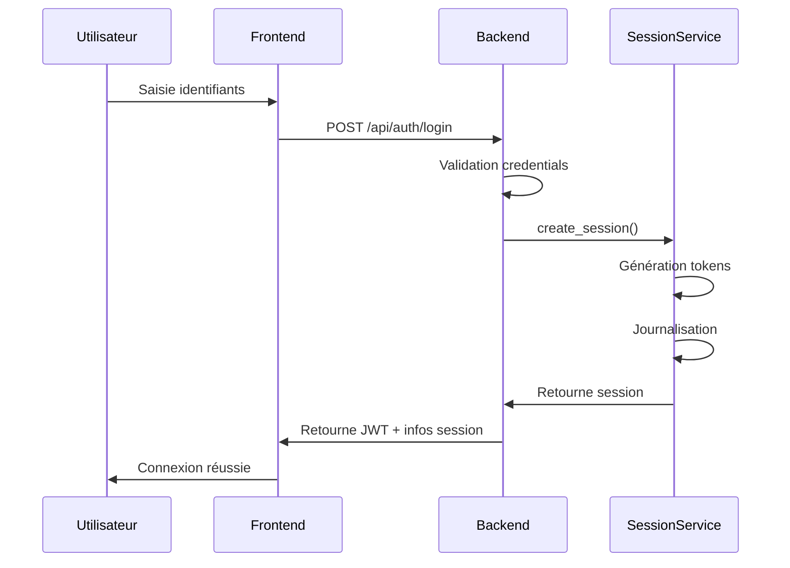
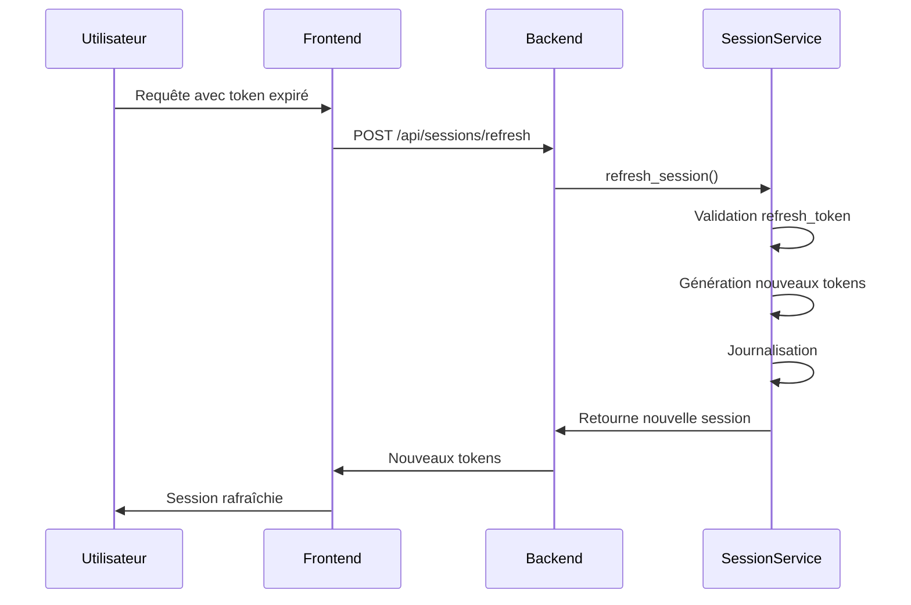
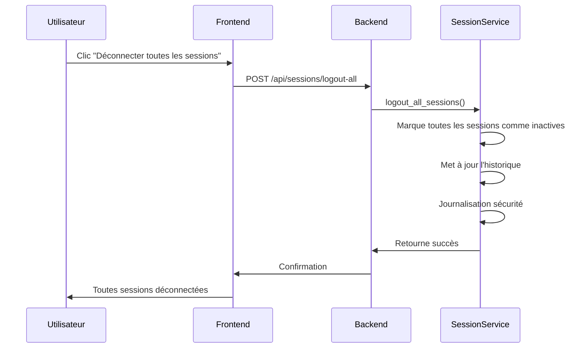

# 📋 Documentation Gestion des Sessions - Issie Tracking

## 🎯 Vue d'ensemble

Ce document décrit l'implémentation du système de gestion des sessions pour l'application Issie Tracking. Le système permet le suivi des connexions actives, l'historique des sessions et la surveillance des événements de sécurité.

## 🏗️ Architecture

### Modèles de données

#### [`UserSession`](backend/app/models/session.py:1)
```python
class UserSession(Base):
    __tablename__ = "user_sessions"
    
    id = Column(Integer, primary_key=True, index=True)
    user_id = Column(Integer, ForeignKey("users.id"), nullable=False, index=True)
    session_token = Column(String(512), unique=True, index=True, nullable=False)
    ip_address = Column(String(45), nullable=False)
    user_agent = Column(Text, nullable=True)
    device_type = Column(String(50), nullable=True)
    browser = Column(String(100), nullable=True)
    platform = Column(String(50), nullable=True)
    created_at = Column(DateTime, default=datetime.utcnow, nullable=False)
    last_activity = Column(DateTime, default=datetime.utcnow, nullable=False)
    expires_at = Column(DateTime, nullable=False)
    is_active = Column(Boolean, default=True, nullable=False)
    is_mobile = Column(Boolean, default=False, nullable=False)
    refresh_token = Column(String(512), unique=True, index=True, nullable=True)
    csrf_token = Column(String(128), nullable=True)
```

#### [`LoginHistory`](backend/app/models/session.py:2)
```python
class LoginHistory(Base):
    __tablename__ = "login_history"
    
    id = Column(Integer, primary_key=True, index=True)
    user_id = Column(Integer, ForeignKey("users.id"), nullable=False, index=True)
    login_type = Column(String(50), nullable=False)
    provider = Column(String(50), nullable=True)
    ip_address = Column(String(45), nullable=False)
    user_agent = Column(Text, nullable=True)
    location = Column(String(100), nullable=True)
    success = Column(Boolean, default=True, nullable=False)
    failure_reason = Column(Text, nullable=True)
    login_at = Column(DateTime, default=datetime.utcnow, nullable=False)
    logout_at = Column(DateTime, nullable=True)
    session_id = Column(Integer, ForeignKey("user_sessions.id"), nullable=True)
```

#### [`SecurityEvent`](backend/app/models/session.py:3)
```python
class SecurityEvent(Base):
    __tablename__ = "security_events"
    
    id = Column(Integer, primary_key=True, index=True)
    user_id = Column(Integer, ForeignKey("users.id"), nullable=True, index=True)
    event_type = Column(String(100), nullable=False)
    severity = Column(String(20), nullable=False)
    description = Column(Text, nullable=False)
    ip_address = Column(String(45), nullable=True)
    user_agent = Column(Text, nullable=True)
    metadata = Column(Text, nullable=True)
    created_at = Column(DateTime, default=datetime.utcnow, nullable=False)
    session_id = Column(Integer, ForeignKey("user_sessions.id"), nullable=True)
```

## 🔧 Service de Sessions

### [`SessionService`](backend/app/services/session_service.py:32)

Le service principal [`SessionService`](backend/app/services/session_service.py:32) gère :

- Création et validation des sessions
- Rafraîchissement des tokens
- Déconnexion des sessions
- Historique des connexions
- Événements de sécurité
- Nettoyage automatique des sessions expirées

### Méthodes principales

```python
class SessionService:
    def create_session(self, user: User, ip_address: str, user_agent: Optional[str] = None,
                      device_type: str = "web", is_mobile: bool = False,
                      session_duration_hours: int = 24) -> UserSession
    
    def validate_session(self, session_token: str, ip_address: str, 
                        user_agent: Optional[str] = None) -> UserSession
    
    def refresh_session(self, refresh_token: str, ip_address: str,
                       user_agent: Optional[str] = None) -> UserSession
    
    def logout_session(self, session_token: str, ip_address: str,
                      user_agent: Optional[str] = None) -> bool
    
    def logout_all_sessions(self, user: User, ip_address: str,
                           user_agent: Optional[str] = None) -> bool
    
    def get_active_sessions(self, user: User) -> List[UserSession]
    
    def get_session_history(self, user: User, limit: int = 50) -> List[LoginHistory]
    
    def log_login_attempt(self, user: User, login_type: str, ip_address: str,
                         user_agent: Optional[str] = None, provider: Optional[str] = None,
                         success: bool = True, failure_reason: Optional[str] = None,
                         session: Optional[UserSession] = None) -> LoginHistory
    
    def cleanup_expired_sessions(self) -> int
    
    def get_security_events(self, user: User, limit: int = 100) -> List[SecurityEvent]
```

## 🚀 API Endpoints

### 1. Sessions Actives

**Endpoint:** `GET /api/sessions/active`

**Headers:**
- `Authorization: Bearer {jwt_token}`

**Réponse:**
```json
{
  "sessions": [
    {
      "id": 1,
      "ip_address": "192.168.1.100",
      "device_type": "web",
      "browser": "Chrome",
      "platform": "Windows",
      "created_at": "2024-01-01T10:00:00Z",
      "last_activity": "2024-01-01T11:30:00Z",
      "expires_at": "2024-01-02T10:00:00Z",
      "is_mobile": false
    }
  ],
  "total_active": 1
}
```

### 2. Déconnexion d'une Session

**Endpoint:** `DELETE /api/sessions/{session_id}`

**Headers:**
- `Authorization: Bearer {jwt_token}`

**Réponse:**
```json
{
  "message": "Session déconnectée avec succès",
  "session_id": 1
}
```

### 3. Déconnexion de Toutes les Sessions

**Endpoint:** `POST /api/sessions/logout-all`

**Headers:**
- `Authorization: Bearer {jwt_token}`

**Réponse:**
```json
{
  "message": "Toutes les sessions ont été déconnectées avec succès"
}
```

### 4. Historique des Connexions

**Endpoint:** `GET /api/sessions/history?limit=50`

**Headers:**
- `Authorization: Bearer {jwt_token}`

**Réponse:**
```json
{
  "history": [
    {
      "id": 1,
      "login_type": "password",
      "provider": null,
      "ip_address": "192.168.1.100",
      "location": null,
      "success": true,
      "failure_reason": null,
      "login_at": "2024-01-01T10:00:00Z",
      "logout_at": "2024-01-01T11:30:00Z",
      "duration_seconds": 5400
    }
  ],
  "total_entries": 1
}
```

### 5. Événements de Sécurité

**Endpoint:** `GET /api/sessions/security-events?limit=100`

**Headers:**
- `Authorization: Bearer {jwt_token}`

**Réponse:**
```json
{
  "events": [
    {
      "id": 1,
      "event_type": "session_created",
      "severity": "low",
      "description": "Nouvelle session créée depuis 192.168.1.100",
      "ip_address": "192.168.1.100",
      "created_at": "2024-01-01T10:00:00Z"
    }
  ],
  "total_events": 1
}
```

### 6. Rafraîchissement de Session

**Endpoint:** `POST /api/sessions/refresh`

**Body:**
```json
{
  "refresh_token": "refresh_token_here"
}
```

**Réponse:**
```json
{
  "message": "Session rafraîchie avec succès",
  "session_id": 1
}
```

### 7. Nettoyage des Sessions Expirées

**Endpoint:** `POST /api/sessions/cleanup`

**Headers:**
- `Authorization: Bearer {jwt_token}` (Admin)

**Réponse:**
```json
{
  "message": "5 sessions expirées nettoyées",
  "cleaned_count": 5
}
```

## 🛡️ Sécurité

### Protection des Sessions

- **Tokens sécurisés** : Génération de tokens uniques avec `secrets.token_urlsafe()`
- **Expiration automatique** : Sessions expirant après 24 heures par défaut
- **Rafraîchissement sécurisé** : Tokens de rafraîchissement avec rotation
- **Limite de sessions** : Maximum 5 sessions actives par utilisateur
- **Validation CSRF** : Protection contre les attaques CSRF

### Surveillance de Sécurité

- **Journalisation complète** : Toutes les tentatives de connexion
- **Détection d'anomalies** : Événements de sécurité classés par sévérité
- **Géolocalisation** : Détection approximative de la localisation
- **Analyse du User-Agent** : Détection du navigateur et de la plateforme

### Types d'Événements de Sécurité

- `session_created` - Nouvelle session créée
- `session_expired` - Session expirée automatiquement
- `session_refreshed` - Session rafraîchie
- `session_logout` - Déconnexion utilisateur
- `all_sessions_logout` - Déconnexion de toutes les sessions
- `login_failed` - Tentative de connexion échouée
- `session_cleanup` - Nettoyage automatique de session
- `suspicious_activity` - Activité suspecte détectée

## 🔄 Intégration avec l'Authentification

### Authentification Standard

```python
# Après une authentification réussie
session = session_service.create_session(
    user=user,
    ip_address=request.client.host,
    user_agent=request.headers.get("user-agent"),
    login_type="password"
)

# Journalise la tentative de connexion
session_service.log_login_attempt(
    user=user,
    login_type="password",
    ip_address=request.client.host,
    user_agent=request.headers.get("user-agent"),
    success=True,
    session=session
)
```

### Authentification OAuth2

```python
# Après une authentification OAuth2 réussie
session = session_service.create_session(
    user=user,
    ip_address=request.client.host,
    user_agent=request.headers.get("user-agent"),
    login_type=f"oauth_{provider}"
)

# Journalise la tentative de connexion
session_service.log_login_attempt(
    user=user,
    login_type=f"oauth_{provider}",
    provider=provider,
    ip_address=request.client.host,
    user_agent=request.headers.get("user-agent"),
    success=True,
    session=session
)
```

### Authentification MFA

```python
# Après une authentification MFA réussie
session = session_service.create_session(
    user=user,
    ip_address=request.client.host,
    user_agent=request.headers.get("user-agent"),
    login_type="mfa_password"
)

# Journalise la tentative de connexion
session_service.log_login_attempt(
    user=user,
    login_type="mfa_password",
    ip_address=request.client.host,
    user_agent=request.headers.get("user-agent"),
    success=True,
    session=session
)
```

## 📊 Monitoring et Métriques

### Métriques à Surveiller

- **Sessions actives** : Nombre de sessions actives par utilisateur
- **Durée moyenne des sessions** : Temps moyen d'une session
- **Taux de déconnexion** : Pourcentage de sessions déconnectées manuellement
- **Échecs de connexion** : Nombre de tentatives échouées
- **Événements de sécurité** : Distribution par type et sévérité

### Alertes Recommandées

- **Trop de sessions actives** : > 5 sessions par utilisateur
- **Activité suspecte** : Connexions depuis des localisations géographiques éloignées
- **Échecs répétés** : Plus de 5 échecs de connexion en 10 minutes
- **Sessions expirées** : Nombre élevé de sessions expirées non nettoyées

## 🚨 Gestion des Erreurs

### Exceptions de Sessions

- [`SessionNotFoundException`](backend/app/exceptions/session_exceptions.py:1) - Session non trouvée
- [`SessionExpiredException`](backend/app/exceptions/session_exceptions.py:2) - Session expirée
- [`InvalidSessionException`](backend/app/exceptions/session_exceptions.py:3) - Session inactive
- [`TooManyActiveSessionsException`](backend/app/exceptions/session_exceptions.py:4) - Trop de sessions actives
- [`SessionSecurityException`](backend/app/exceptions/session_exceptions.py:5) - Problème de sécurité
- [`CSRFValidationException`](backend/app/exceptions/session_exceptions.py:6) - Token CSRF invalide
- [`RefreshTokenException`](backend/app/exceptions/session_exceptions.py:7) - Échec du rafraîchissement

### Codes HTTP

- `200 OK` - Opération réussie
- `400 Bad Request` - Paramètres invalides
- `401 Unauthorized` - Session expirée ou invalide
- `403 Forbidden` - Trop de sessions ou problème de sécurité
- `404 Not Found` - Session non trouvée
- `500 Internal Server Error` - Erreur serveur

## 🔧 Configuration

### Variables d'Environnement

```bash
# Durée par défaut des sessions (en heures)
SESSION_DURATION_HOURS=24

# Nombre maximum de sessions actives par utilisateur
MAX_ACTIVE_SESSIONS=5

# Intervalle de nettoyage automatique (en minutes)
SESSION_CLEANUP_INTERVAL=60
```

### Configuration du Service

```python
class SessionService:
    def __init__(self, db: Session):
        self.db = db
        self.max_active_sessions = 5  # Configurable
        self.session_duration_hours = 24  # Configurable
```

## 🧪 Tests

### Scénarios de Test Recommandés

1. **Création de session** : Test de création réussie avec tokens
2. **Validation de session** : Test de validation avec mise à jour d'activité
3. **Rafraîchissement** : Test de rafraîchissement avec nouveaux tokens
4. **Déconnexion** : Test de déconnexion simple et globale
5. **Limites** : Test de la limite de sessions actives
6. **Expiration** : Test de l'expiration automatique des sessions
7. **Sécurité** : Test des événements de sécurité et journalisation

### Tests d'Intégration

- Intégration avec l'authentification standard
- Intégration avec OAuth2
- Intégration avec MFA
- Tests de performance avec nombreuses sessions

## 📈 Déploiement

### Checklist de Déploiement

- [ ] Configurer les variables d'environnement
- [ ] Mettre en place le nettoyage automatique des sessions
- [ ] Configurer le monitoring des métriques de sessions
- [ ] Mettre en place les alertes de sécurité
- [ ] Tester l'intégration avec tous les types d'authentification
- [ ] Documenter les procédures de dépannage

### Considerations de Performance

- **Indexation** : Index sur les champs fréquemment interrogés
- **Nettoyage régulier** : Nettoyage automatique des sessions expirées
- **Archivage** : Archivage périodique de l'historique ancien
- **Monitoring** : Surveillance des performances des requêtes de sessions

## 🔄 Workflows d'Utilisation

### Connexion Utilisateur



### Rafraîchissement de Session



### Déconnexion Globale



---

*Dernière mise à jour: 2024-01-01*  
*Version: 1.0.0*