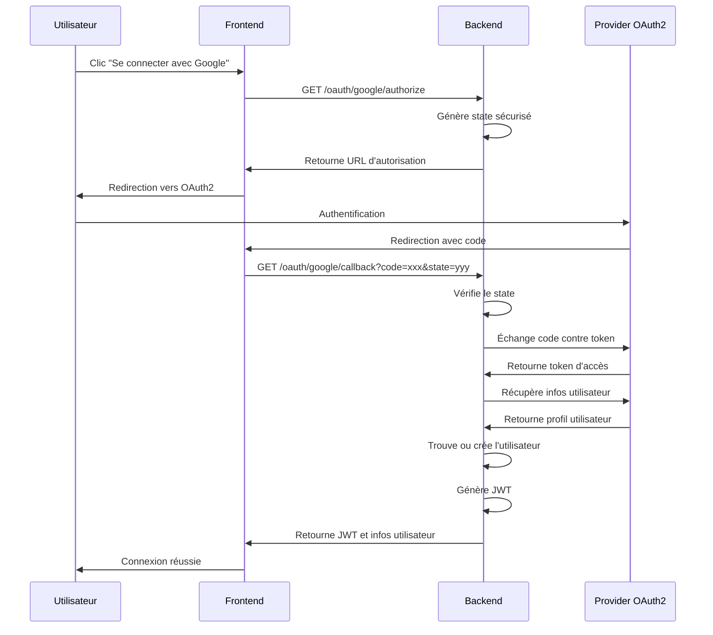

# 📋 Documentation OAuth2 - Issie Tracking

## 🎯 Vue d'ensemble

Ce document décrit l'implémentation du système d'authentification OAuth2 pour l'application Issie Tracking. Le système supporte actuellement 4 providers OAuth2 :

- **Google** - OAuth2 avec OpenID Connect
- **GitHub** - OAuth2 standard
- **Microsoft** - OAuth2 avec Microsoft Graph API
- **Facebook** - OAuth2 avec Facebook Graph API

## 🏗️ Architecture

### Modèles de données

#### [`OAuthProvider`](backend/app/models/oauth.py:1)
```python
class OAuthProvider(Base):
    __tablename__ = "oauth_providers"
    
    id = Column(Integer, primary_key=True, index=True)
    name = Column(String(50), unique=True, index=True)  # google, github, microsoft, facebook
    display_name = Column(String(100))
    is_active = Column(Boolean, default=True)
    created_at = Column(DateTime, default=datetime.utcnow)
    
    oauth_users = relationship("OAuthUser", back_populates="provider")
```

#### [`OAuthUser`](backend/app/models/oauth.py:2)
```python
class OAuthUser(Base):
    __tablename__ = "oauth_users"
    
    id = Column(Integer, primary_key=True, index=True)
    user_id = Column(Integer, ForeignKey("users.id"))
    provider_id = Column(Integer, ForeignKey("oauth_providers.id"))
    provider_user_id = Column(String(255), nullable=False)
    email = Column(String(255))
    profile_data = Column(JSON)
    created_at = Column(DateTime, default=datetime.utcnow)
    
    user = relationship("User", back_populates="oauth_accounts")
    provider = relationship("OAuthProvider", back_populates="oauth_users")
```

#### [`OAuthState`](backend/app/models/oauth.py:3)
```python
class OAuthState(Base):
    __tablename__ = "oauth_states"
    
    id = Column(Integer, primary_key=True, index=True)
    state = Column(String(255), unique=True, index=True)
    provider = Column(String(50))
    redirect_uri = Column(String(500))
    expires_at = Column(DateTime)
    created_at = Column(DateTime, default=datetime.utcnow)
```

#### [`OAuthLoginAttempt`](backend/app/models/oauth.py:4)
```python
class OAuthLoginAttempt(Base):
    __tablename__ = "oauth_login_attempts"
    
    id = Column(Integer, primary_key=True, index=True)
    provider = Column(String(50))
    provider_user_id = Column(String(255))
    email = Column(String(255))
    ip_address = Column(String(45))
    user_agent = Column(Text)
    success = Column(Boolean, default=False)
    failure_reason = Column(Text)
    created_at = Column(DateTime, default=datetime.utcnow)
```

## 🔧 Configuration

### Variables d'environnement

Le fichier [`backend/.env.example`](backend/.env.example:1) contient toutes les variables nécessaires :

```bash
# Configuration OAuth2 Google
GOOGLE_OAUTH_CLIENT_ID=votre_client_id_google
GOOGLE_OAUTH_CLIENT_SECRET=votre_client_secret_google
GOOGLE_OAUTH_REDIRECT_URI=http://localhost:3000/oauth/callback

# Configuration OAuth2 GitHub
GITHUB_OAUTH_CLIENT_ID=votre_client_id_github
GITHUB_OAUTH_CLIENT_SECRET=votre_client_secret_github
GITHUB_OAUTH_REDIRECT_URI=http://localhost:3000/oauth/callback

# Configuration OAuth2 Microsoft
MICROSOFT_OAUTH_CLIENT_ID=votre_client_id_microsoft
MICROSOFT_OAUTH_CLIENT_SECRET=votre_client_secret_microsoft
MICROSOFT_OAUTH_REDIRECT_URI=http://localhost:3000/oauth/callback

# Configuration OAuth2 Facebook
FACEBOOK_OAUTH_CLIENT_ID=votre_client_id_facebook
FACEBOOK_OAUTH_CLIENT_SECRET=votre_client_secret_facebook
FACEBOOK_OAUTH_REDIRECT_URI=http://localhost:3000/oauth/callback
```

### Configuration centralisée

La classe [`OAuthConfig`](backend/oauth_config.py:10) dans [`backend/oauth_config.py`](backend/oauth_config.py:1) centralise toute la configuration OAuth2.

## 🚀 API Endpoints

### 1. Obtenir l'URL d'autorisation

**Endpoint:** `GET /oauth/{provider}/authorize`

**Paramètres:**
- `provider`: google, github, microsoft, facebook
- `redirect_uri`: URI de redirection (optionnel)

**Réponse:**
```json
{
  "authorization_url": "https://accounts.google.com/o/oauth2/v2/auth?...",
  "state": "abc123..."
}
```

### 2. Callback OAuth2

**Endpoint:** `GET /oauth/{provider}/callback`

**Paramètres:**
- `code`: Code d'autorisation
- `state`: State pour la sécurité CSRF

**Réponse:**
```json
{
  "access_token": "jwt_token_here",
  "token_type": "bearer",
  "user": {
    "id": 1,
    "username": "john_doe",
    "email": "john@example.com"
  }
}
```

### 3. Associer un compte OAuth2

**Endpoint:** `POST /oauth/{provider}/link`

**Headers:**
- `Authorization: Bearer {jwt_token}`

**Réponse:**
```json
{
  "message": "Compte OAuth2 associé avec succès",
  "provider": "google"
}
```

### 4. Dissocier un compte OAuth2

**Endpoint:** `DELETE /oauth/{provider}/unlink`

**Headers:**
- `Authorization: Bearer {jwt_token}`

**Réponse:**
```json
{
  "message": "Compte OAuth2 dissocié avec succès",
  "provider": "google"
}
```

### 5. Lister les comptes OAuth2 associés

**Endpoint:** `GET /oauth/accounts`

**Headers:**
- `Authorization: Bearer {jwt_token}`

**Réponse:**
```json
{
  "accounts": [
    {
      "provider": "google",
      "email": "john@example.com",
      "created_at": "2024-01-01T10:00:00Z"
    }
  ]
}
```

## 🔄 Flux OAuth2

### Flux d'authentification

1. **Étape 1:** L'utilisateur clique sur "Se connecter avec Google"
2. **Étape 2:** L'application redirige vers l'URL d'autorisation OAuth2
3. **Étape 3:** L'utilisateur s'authentifie chez le provider
4. **Étape 4:** Le provider redirige vers notre callback avec un code
5. **Étape 5:** Notre backend échange le code contre un token d'accès
6. **Étape 6:** Récupération des informations utilisateur
7. **Étape 7:** Création ou association du compte utilisateur
8. **Étape 8:** Génération d'un JWT pour l'utilisateur

### Diagramme de séquence



## 🛡️ Sécurité

### Protection CSRF avec State

- Génération d'un state aléatoire de 32 caractères
- Stockage en base de données avec expiration (10 minutes)
- Vérification obligatoire lors du callback

### Validation des tokens

- Vérification de la signature JWT
- Vérification de l'expiration
- Validation des scopes OAuth2

### Journalisation

Toutes les tentatives de connexion OAuth2 sont journalisées dans [`OAuthLoginAttempt`](backend/app/models/oauth.py:4) pour l'audit et la sécurité.

## 🔧 Service OAuth2

Le service principal [`OAuthService`](backend/app/services/oauth_service.py:32) dans [`backend/app/services/oauth_service.py`](backend/app/services/oauth_service.py:1) gère :

- Génération des URLs d'autorisation
- Échange des codes contre tokens
- Récupération des informations utilisateur
- Normalisation des données utilisateur
- Association des comptes OAuth2
- Gestion des states de sécurité

### Méthodes principales

```python
class OAuthService:
    def get_authorization_url(self, provider: str, redirect_uri: str) -> str
    def verify_state(self, state: str, provider: str) -> bool
    def exchange_code_for_token(self, provider: str, code: str, redirect_uri: str) -> Dict[str, Any]
    def get_user_info(self, provider: str, access_token: str) -> Dict[str, Any]
    def find_or_create_user(self, user_info: Dict[str, Any]) -> User
    def link_oauth_account(self, user: User, user_info: Dict[str, Any]) -> OAuthUser
    def unlink_oauth_account(self, user: User, provider: str) -> bool
```

## 🚨 Gestion des erreurs

### Exceptions OAuth2

- [`OAuthProviderNotConfiguredException`](backend/app/exceptions/oauth_exceptions.py:1) - Provider non configuré
- [`OAuthStateNotFoundException`](backend/app/exceptions/oauth_exceptions.py:2) - State invalide ou expiré
- [`OAuthInvalidCodeException`](backend/app/exceptions/oauth_exceptions.py:3) - Code d'autorisation invalide
- [`OAuthUserNotFoundException`](backend/app/exceptions/oauth_exceptions.py:4) - Utilisateur OAuth2 non trouvé
- [`OAuthProviderException`](backend/app/exceptions/oauth_exceptions.py:5) - Erreur générique du provider

### Codes HTTP

- `400 Bad Request` - Paramètres manquants ou invalides
- `401 Unauthorized` - Token invalide ou expiré
- `403 Forbidden` - Accès refusé
- `404 Not Found` - Resource non trouvée
- `500 Internal Server Error` - Erreur serveur

## 📊 Normalisation des données

Chaque provider OAuth2 retourne des données utilisateur dans des formats différents. Le service OAuth2 normalise ces données dans un format standard :

```python
normalized_user_info = {
    "provider": "google",
    "provider_user_id": "123456789",
    "email": "john@example.com",
    "name": "John Doe",
    "given_name": "John",
    "family_name": "Doe",
    "picture": "https://example.com/photo.jpg",
    "locale": "fr-FR",
    "email_verified": True
}
```

## 🔄 Intégration avec l'authentification existante

### Association avec les utilisateurs locaux

- Un utilisateur peut avoir plusieurs comptes OAuth2 associés
- Les comptes OAuth2 peuvent être liés à des comptes existants
- Génération automatique de nom d'utilisateur unique

### JWT Integration

- Génération de JWT standard après authentification OAuth2
- Compatibilité avec le système d'authentification existant
- Support des rôles et permissions RBAC

## 🧪 Tests

### Tests unitaires

```python
def test_oauth_authorization_url():
    service = OAuthService(db)
    url, state = service.get_authorization_url("google", "http://localhost:3000/callback")
    assert "accounts.google.com" in url
    assert len(state) == 43  # 32 bytes en base64

def test_oauth_user_creation():
    user_info = {
        "provider": "google",
        "provider_user_id": "123",
        "email": "test@example.com"
    }
    user = service.find_or_create_user(user_info)
    assert user.email == "test@example.com"
```

### Tests d'intégration

- Test du flux complet OAuth2
- Test des callbacks avec différents providers
- Test de l'association/dissociation des comptes

## 📈 Monitoring

### Métriques à surveiller

- Nombre de connexions OAuth2 par provider
- Taux de réussite/échec des authentifications
- Temps de réponse des providers OAuth2
- Nombre d'utilisateurs avec comptes OAuth2 associés

### Logs importants

- Tentatives de connexion OAuth2
- Erreurs d'authentification
- Associations/dissociations de comptes

## 🔧 Configuration des providers

### Google OAuth2

1. Aller sur [Google Cloud Console](https://console.cloud.google.com/)
2. Créer un nouveau projet
3. Activer l'API Google+
4. Créer des identifiants OAuth 2.0
5. Ajouter l'URI de redirection : `http://localhost:3000/oauth/callback`

### GitHub OAuth2

1. Aller sur [GitHub Settings > Developer settings > OAuth Apps](https://github.com/settings/developers)
2. Créer une nouvelle OAuth App
3. Homepage URL: `http://localhost:3000`
4. Authorization callback URL: `http://localhost:3000/oauth/callback`

### Microsoft OAuth2

1. Aller sur [Azure Portal](https://portal.azure.com/)
2. Azure Active Directory > App registrations
3. Créer une nouvelle inscription d'application
4. Plateformes > Ajouter une plateforme > Web
5. URL de redirection: `http://localhost:3000/oauth/callback`

### Facebook OAuth2

1. Aller sur [Facebook Developers](https://developers.facebook.com/)
2. Créer une nouvelle application
3. Ajouter le produit "Facebook Login"
4. Configurer les URLs OAuth valides
5. URL de redirection: `http://localhost:3000/oauth/callback`

## 🚀 Déploiement

### Variables d'environnement de production

```bash
# Production
GOOGLE_OAUTH_CLIENT_ID=your_production_client_id
GOOGLE_OAUTH_CLIENT_SECRET=your_production_client_secret
GOOGLE_OAUTH_REDIRECT_URI=https://yourdomain.com/oauth/callback

# Répéter pour chaque provider...
```

### Considerations de sécurité

- Utiliser HTTPS en production
- Valider les URIs de redirection
- Mettre à jour régulièrement les dépendances OAuth2
- Surveiller les logs de sécurité

## 📝 Checklist de déploiement

- [ ] Configurer les variables d'environnement
- [ ] Vérifier les URIs de redirection
- [ ] Tester chaque provider OAuth2
- [ ] Configurer le logging et le monitoring
- [ ] Mettre en place l'alerting sur les erreurs
- [ ] Documenter les procédures de dépannage

---

*Dernière mise à jour: 2024-01-01*
