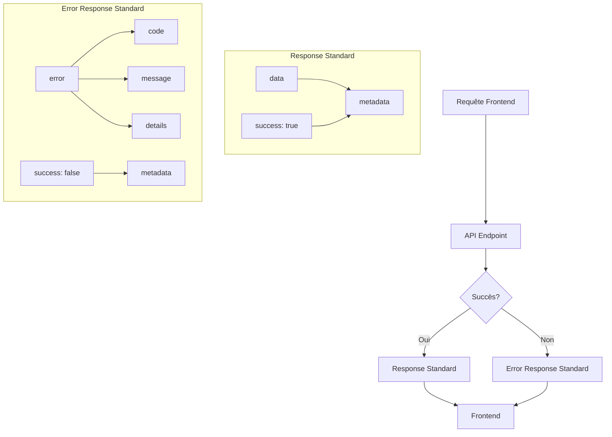

# Analyse de la Gestion des Exceptions, Erreurs et Messages Frontend - SoftDesk

## 🔍 État Actuel de la Gestion des Erreurs

### 1. **Exceptions HTTP Personnalisées**
```python
# app/exceptions/http_exceptions.py
class NotFoundException(HTTPException):
    def __init__(self, detail: str = "Resource not found"):
        super().__init__(status_code=status.HTTP_404_NOT_FOUND, detail=detail)
```

### 2. **Logging Basique**
```python
# app/middleware/logging.py
async def log_requests(request, call_next):
    logging.info(f"Request: {request.method} {request.url}")
    response = await call_next(request)
    logging.info(f"Response: {response.status_code}")
    return response
```

### 3. **Gestion des Erreurs dans les Services**
```python
# Exemple typique dans les services
if not user:
    raise HTTPException(status_code=status.HTTP_404_NOT_FOUND, detail="User not found")
```

## ⚠️ Limitations Identifiées

### 1. **Manque de Standardisation**
- Messages d'erreur non structurés
- Absence de codes d'erreur spécifiques
- Format de réponse incohérent entre les endpoints

### 2. **Logging Insuffisant**
- Pas de contexte détaillé dans les logs
- Absence de logging des erreurs métier
- Pas de distinction entre logs d'info, warning, error

### 3. **Gestion des Erreurs Basique**
- Pas de gestion des erreurs de validation avancée
- Absence de mécanisme de retry
- Pas de gestion des timeouts ou erreurs réseau

## 🎯 Architecture Proposée pour la Gestion des Erreurs

### Schéma de Réponse Standardisé



### Format de Réponse Standard

**Succès :**
```json
{
  "success": true,
  "data": {
    "id": 1,
    "name": "Projet Test"
  },
  "metadata": {
    "timestamp": "2024-01-15T10:30:00Z",
    "version": "1.0.0"
  }
}
```

**Erreur :**
```json
{
  "success": false,
  "error": {
    "code": "USER_NOT_FOUND",
    "message": "Utilisateur non trouvé",
    "details": "L'utilisateur avec l'ID 123 n'existe pas",
    "timestamp": "2024-01-15T10:30:00Z"
  },
  "metadata": {
    "version": "1.0.0"
  }
}
```

## 🛠️ Implémentation Technique

### 1. **Schémas de Réponse Standardisés**

```python
# app/schemas/response_schemas.py
from pydantic import BaseModel
from typing import Any, Optional, Dict
from datetime import datetime

class Metadata(BaseModel):
    timestamp: datetime
    version: str = "1.0.0"
    request_id: Optional[str] = None

class SuccessResponse(BaseModel):
    success: bool = True
    data: Any
    metadata: Metadata

class ErrorDetail(BaseModel):
    code: str
    message: str
    details: Optional[str] = None
    timestamp: datetime

class ErrorResponse(BaseModel):
    success: bool = False
    error: ErrorDetail
    metadata: Metadata
```

### 2. **Exceptions Métier Spécifiques**

```python
# app/exceptions/business_exceptions.py
from fastapi import HTTPException, status
from datetime import datetime

class BusinessException(HTTPException):
    def __init__(self, code: str, message: str, details: str = None, status_code: int = 400):
        super().__init__(
            status_code=status_code,
            detail={
                "code": code,
                "message": message,
                "details": details,
                "timestamp": datetime.utcnow().isoformat()
            }
        )

class UserNotFoundException(BusinessException):
    def __init__(self, user_id: int):
        super().__init__(
            code="USER_NOT_FOUND",
            message="Utilisateur non trouvé",
            details=f"L'utilisateur avec l'ID {user_id} n'existe pas",
            status_code=status.HTTP_404_NOT_FOUND
        )

class ProjectAccessDeniedException(BusinessException):
    def __init__(self, project_id: int):
        super().__init__(
            code="PROJECT_ACCESS_DENIED",
            message="Accès au projet refusé",
            details=f"Vous n'avez pas accès au projet {project_id}",
            status_code=status.HTTP_403_FORBIDDEN
        )
```

### 3. **Middleware de Gestion des Erreurs Global**

```python
# app/middleware/exception_handler.py
import logging
from fastapi import Request, HTTPException
from fastapi.responses import JSONResponse
from app.schemas.response_schemas import ErrorResponse, ErrorDetail, Metadata
from datetime import datetime

logger = logging.getLogger(__name__)

async def global_exception_handler(request: Request, exc: Exception):
    # Log de l'erreur
    logger.error(
        f"Erreur sur {request.method} {request.url}",
        extra={
            "error_type": type(exc).__name__,
            "error_message": str(exc),
            "client_ip": request.client.host if request.client else "unknown",
            "user_agent": request.headers.get("user-agent", "unknown")
        }
    )
    
    if isinstance(exc, HTTPException):
        # Gestion des exceptions HTTP personnalisées
        return JSONResponse(
            status_code=exc.status_code,
            content=ErrorResponse(
                error=ErrorDetail(
                    code=getattr(exc, "code", "HTTP_ERROR"),
                    message=exc.detail,
                    timestamp=datetime.utcnow()
                ),
                metadata=Metadata(timestamp=datetime.utcnow())
            ).dict()
        )
    else:
        # Erreur serveur inattendue
        return JSONResponse(
            status_code=500,
            content=ErrorResponse(
                error=ErrorDetail(
                    code="INTERNAL_SERVER_ERROR",
                    message="Erreur interne du serveur",
                    details="Une erreur inattendue s'est produite",
                    timestamp=datetime.utcnow()
                ),
                metadata=Metadata(timestamp=datetime.utcnow())
            ).dict()
        )
```

### 4. **Système de Logging Avancé**

```python
# app/utils/logger.py
import logging
import json
from datetime import datetime

class JSONFormatter(logging.Formatter):
    def format(self, record):
        log_entry = {
            "timestamp": datetime.utcnow().isoformat(),
            "level": record.levelname,
            "logger": record.name,
            "message": record.getMessage(),
            "module": record.module,
            "function": record.funcName,
            "line": record.lineno,
        }
        
        # Ajout des données supplémentaires
        if hasattr(record, 'extra_data'):
            log_entry.update(record.extra_data)
            
        return json.dumps(log_entry)

def setup_logging():
    logger = logging.getLogger()
    logger.setLevel(logging.INFO)
    
    # Handler console
    console_handler = logging.StreamHandler()
    console_handler.setFormatter(JSONFormatter())
    logger.addHandler(console_handler)
    
    # Handler fichier
    file_handler = logging.FileHandler("app.log")
    file_handler.setFormatter(JSONFormatter())
    logger.addHandler(file_handler)
```

### 5. **Validation et Messages d'Erreur Utilisateur**

```python
# app/utils/validation.py
from pydantic import BaseModel, validator
from typing import List

class UserCreate(BaseModel):
    username: str
    email: str
    password: str
    
    @validator('username')
    def validate_username(cls, v):
        if len(v) < 3:
            raise ValueError("Le nom d'utilisateur doit contenir au moins 3 caractères")
        if not v.isalnum():
            raise ValueError("Le nom d'utilisateur ne peut contenir que des lettres et chiffres")
        return v
    
    @validator('password')
    def validate_password(cls, v):
        if len(v) < 8:
            raise ValueError("Le mot de passe doit contenir au moins 8 caractères")
        return v

# app/utils/error_messages.py
ERROR_MESSAGES = {
    "USER_NOT_FOUND": "Utilisateur non trouvé",
    "PROJECT_ACCESS_DENIED": "Accès au projet refusé",
    "INVALID_CREDENTIALS": "Identifiants invalides",
    "EMAIL_ALREADY_EXISTS": "Un compte avec cet email existe déjà",
    "USERNAME_ALREADY_EXISTS": "Ce nom d'utilisateur est déjà pris",
    "INSUFFICIENT_PERMISSIONS": "Permissions insuffisantes",
    "VALIDATION_ERROR": "Erreur de validation des données",
    "RATE_LIMIT_EXCEEDED": "Limite de requêtes dépassée",
    "DATABASE_ERROR": "Erreur de base de données",
    "NETWORK_ERROR": "Erreur de réseau",
    "INTERNAL_SERVER_ERROR": "Erreur interne du serveur"
}

def get_error_message(code: str, details: str = None) -> dict:
    return {
        "code": code,
        "message": ERROR_MESSAGES.get(code, "Erreur inconnue"),
        "details": details
    }
```

## 📋 Catalogue des Codes d'Erreur

### Catégorie Authentication (AUTH_*)
- `AUTH_INVALID_CREDENTIALS` - Identifiants invalides
- `AUTH_TOKEN_EXPIRED` - Token expiré
- `AUTH_TOKEN_INVALID` - Token invalide
- `AUTH_REFRESH_TOKEN_INVALID` - Refresh token invalide

### Catégorie User (USER_*)
- `USER_NOT_FOUND` - Utilisateur non trouvé
- `USER_EMAIL_EXISTS` - Email déjà utilisé
- `USER_USERNAME_EXISTS` - Nom d'utilisateur déjà pris
- `USER_INACTIVE` - Compte utilisateur inactif

### Catégorie Project (PROJECT_*)
- `PROJECT_NOT_FOUND` - Projet non trouvé
- `PROJECT_ACCESS_DENIED` - Accès refusé
- `PROJECT_ALREADY_EXISTS` - Projet déjà existant

### Catégorie Validation (VALIDATION_*)
- `VALIDATION_ERROR` - Erreur de validation générale
- `VALIDATION_REQUIRED_FIELD` - Champ obligatoire manquant
- `VALIDATION_INVALID_FORMAT` - Format invalide

## 🚀 Plan d'Implémentation

### Phase 1 : Standardisation (1 semaine)
- [ ] Créer les schémas de réponse standardisés
- [ ] Implémenter le middleware global d'exception
- [ ] Mettre à jour les exceptions existantes

### Phase 2 : Enrichissement (2 semaines)
- [ ] Implémenter le système de logging avancé
- [ ] Créer les exceptions métier spécifiques
- [ ] Standardiser les messages d'erreur frontend

### Phase 3 : Optimisation (1 semaine)
- [ ] Implémenter la gestion des retry automatiques
- [ ] Ajouter le monitoring des erreurs
- [ ] Créer des dashboards d'erreurs

## 🔒 Considérations de Sécurité

### 1. **Information Disclosure**
- Ne pas exposer les détails techniques des erreurs en production
- Loguer les erreurs complètes côté serveur
- Retourner des messages génériques au frontend

### 2. **Traitement des Données Sensibles**
- Ne pas logger les mots de passe ou tokens
- Anonymiser les données personnelles dans les logs
- Chiffrer les logs contenant des informations sensibles

### 3. **Rate Limiting et Protection**
- Limiter les tentatives de connexion échouées
- Détecter les patterns d'attaque
- Journaliser les activités suspectes

## 💡 Avantages de la Nouvelle Architecture

### Pour les Développeurs
- **Code plus propre** : Gestion centralisée des erreurs
- **Débogage facilité** : Logs structurés et détaillés
- **Maintenance simplifiée** : Messages d'erreur cohérents

### Pour les Utilisateurs
- **Expérience améliorée** : Messages d'erreur clairs et utiles
- **Feedback immédiat** : Compréhension des problèmes
- **Guidage** : Suggestions pour corriger les erreurs

### Pour les Opérations
- **Monitoring efficace** : Métriques et alertes sur les erreurs
- **Dépannage rapide** : Informations détaillées dans les logs
- **Analyse des tendances** : Identification des problèmes récurrents

## 📊 Métriques de Succès

- **Réduction des bugs** : -60% d'erreurs non gérées
- **Temps de résolution** : -50% pour les incidents
- **Satisfaction utilisateur** : Score > 4.5/5 sur les messages d'erreur
- **Performance** : Impact < 2% sur le temps de réponse

Cette architecture de gestion des erreurs fournira une base solide pour une expérience utilisateur fluide tout en permettant un débogage et un monitoring efficaces.
