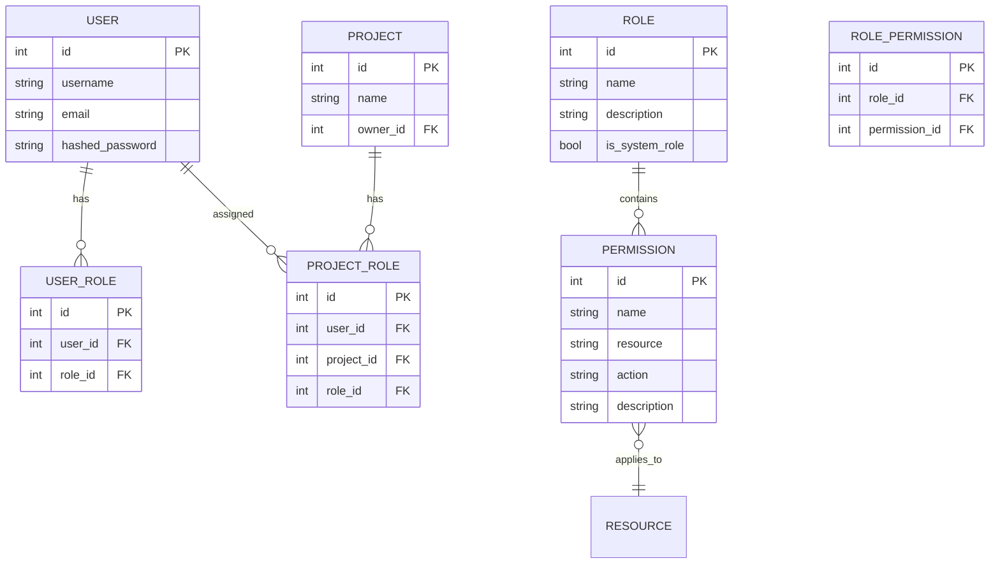

# Analyse de la Gestion des Rôles et Autorisations - SoftDesk

## 🔍 État Actuel des Permissions

### Modèle de Données Actuel
```python
# app/models/contributor.py
class Contributor(Base):
    __tablename__ = "contributors"
    id = Column(Integer, primary_key=True, index=True)
    user_id = Column(Integer, ForeignKey("users.id"))
    project_id = Column(Integer, ForeignKey("projects.id"))
```

### Système de Permissions Actuel
```python
# app/auth/permissions.py
def is_project_contributor(project_id: int, user: User, db: Session) -> User:
    """Vérifie si l'utilisateur est un contributeur du projet."""
```

## ⚠️ Limitations Identifiées

### 1. **Absence de Hiérarchie de Rôles**
- Système binaire : Contributeur vs Non-contributeur
- Pas de distinction entre propriétaire, administrateur, développeur, viewer
- Impossible de définir des permissions granulaires

### 2. **Permissions par Projet Uniquement**
- Pas de permissions globales (admin système)
- Pas de permissions par module (projets, issues, commentaires)
- Impossible de restreindre l'accès à certaines fonctionnalités

### 3. **Vérifications Manuelles et Redondantes**
- Chaque endpoint doit vérifier manuellement les permissions
- Logique de permission dispersée dans les contrôleurs
- Risque d'incohérences et d'oublis

## 🎯 Proposition d'Architecture RBAC (Role-Based Access Control)

### Modèle de Données Recommandé



### Rôles Système Proposés

| Rôle | Permissions | Description |
|------|-------------|-------------|
| **Super Admin** | Toutes les actions sur toutes les ressources | Administrateur système complet |
| **Admin** | Gestion utilisateurs, projets, configuration | Administrateur organisation |
| **Manager** | Création/gestion projets, équipes | Gestionnaire de département |
| **User** | Accès basique, création projets personnels | Utilisateur standard |

### Rôles par Projet

| Rôle | Permissions | Description |
|------|-------------|-------------|
| **Project Owner** | Toutes les actions sur le projet | Créateur du projet |
| **Project Admin** | Gestion membres, configuration projet | Administrateur projet |
| **Developer** | Création/modification issues, commentaires | Développeur actif |
| **Reviewer** | Lecture/commentaires, validation | Relecteur technique |
| **Viewer** | Lecture seule | Observateur |

## 🛠️ Implémentation Technique

### 1. Modèles de Données Étendus

```python
# app/models/role.py
class Role(Base):
    __tablename__ = "roles"
    
    id = Column(Integer, primary_key=True, index=True)
    name = Column(String(50), unique=True, index=True)
    description = Column(String(255))
    is_system_role = Column(Boolean, default=False)
    permissions = relationship("Permission", secondary="role_permissions")

class Permission(Base):
    __tablename__ = "permissions"
    
    id = Column(Integer, primary_key=True, index=True)
    name = Column(String(100), unique=True, index=True)
    resource = Column(String(50))  # 'project', 'issue', 'comment', etc.
    action = Column(String(50))    # 'create', 'read', 'update', 'delete'
    description = Column(String(255))

class UserRole(Base):
    __tablename__ = "user_roles"
    
    id = Column(Integer, primary_key=True, index=True)
    user_id = Column(Integer, ForeignKey("users.id"))
    role_id = Column(Integer, ForeignKey("roles.id"))
    
class ProjectRole(Base):
    __tablename__ = "project_roles"
    
    id = Column(Integer, primary_key=True, index=True)
    user_id = Column(Integer, ForeignKey("users.id"))
    project_id = Column(Integer, ForeignKey("projects.id"))
    role_id = Column(Integer, ForeignKey("roles.id"))
```

### 2. Système de Permissions Centralisé

```python
# app/auth/permission_system.py
class PermissionSystem:
    def __init__(self, db: Session):
        self.db = db
    
    def has_permission(self, user_id: int, resource: str, action: str, project_id: int = None) -> bool:
        """Vérifie si l'utilisateur a la permission demandée"""
        pass
    
    def get_user_permissions(self, user_id: int, project_id: int = None) -> List[str]:
        """Retourne toutes les permissions de l'utilisateur"""
        pass

# app/auth/permission_decorators.py
def require_permission(resource: str, action: str):
    """Décorateur pour vérifier les permissions sur les endpoints"""
    def decorator(func):
        @wraps(func)
        async def wrapper(*args, **kwargs):
            # Logique de vérification des permissions
            pass
        return wrapper
    return decorator
```

### 3. Middleware d'Autorisation

```python
# app/middleware/authorization.py
class AuthorizationMiddleware:
    def __init__(self, app):
        self.app = app
    
    async def __call__(self, scope, receive, send):
        # Vérification des permissions au niveau middleware
        pass
```

## 📋 Matrice des Permissions Détaillée

### Permissions Globales (Rôles Système)

| Permission | Super Admin | Admin | Manager | User |
|------------|-------------|-------|---------|------|
| `user:create` | ✅ | ✅ | ❌ | ❌ |
| `user:read` | ✅ | ✅ | ✅ | ❌ |
| `user:update` | ✅ | ✅ | ❌ | ❌ |
| `user:delete` | ✅ | ✅ | ❌ | ❌ |
| `project:create` | ✅ | ✅ | ✅ | ✅ |
| `system:config` | ✅ | ✅ | ❌ | ❌ |

### Permissions par Projet

| Permission | Owner | Admin | Developer | Reviewer | Viewer |
|------------|-------|-------|-----------|----------|--------|
| `project:read` | ✅ | ✅ | ✅ | ✅ | ✅ |
| `project:update` | ✅ | ✅ | ❌ | ❌ | ❌ |
| `project:delete` | ✅ | ❌ | ❌ | ❌ | ❌ |
| `project:member:add` | ✅ | ✅ | ❌ | ❌ | ❌ |
| `project:member:remove` | ✅ | ✅ | ❌ | ❌ | ❌ |
| `issue:create` | ✅ | ✅ | ✅ | ❌ | ❌ |
| `issue:update` | ✅ | ✅ | ✅ | ❌ | ❌ |
| `issue:delete` | ✅ | ✅ | ❌ | ❌ | ❌ |
| `comment:create` | ✅ | ✅ | ✅ | ✅ | ❌ |
| `comment:update` | ✅ | ✅ | ✅ | ✅ | ❌ |
| `comment:delete` | ✅ | ✅ | ✅ | ❌ | ❌ |

## 🚀 Plan de Migration

### Phase 1 : Préparation (1-2 semaines)
- [ ] Créer les modèles de données pour rôles et permissions
- [ ] Définir la matrice complète des permissions
- [ ] Créer les scripts de migration de données
- [ ] Implémenter le système de permission centralisé

### Phase 2 : Implémentation (2-3 semaines)
- [ ] Mettre à jour les contrôleurs avec le nouveau système
- [ ] Implémenter les décorateurs de permission
- [ ] Créer l'interface de gestion des rôles
- [ ] Migrer les données existantes (contributeurs → rôles)

### Phase 3 : Validation (1 semaine)
- [ ] Tests complets des permissions
- [ ] Audit de sécurité
- [ ] Formation des utilisateurs
- [ ] Documentation mise à jour

## 🔒 Considérations de Sécurité

### 1. **Principe de Moindre Privilège**
- Par défaut, refuser l'accès
- Accorder uniquement les permissions nécessaires
- Révision régulière des permissions

### 2. **Séparation des Préoccupations**
- Logique d'autorisation séparée de la logique métier
- Middleware dédié aux vérifications
- Centralisation de la gestion des permissions

### 3. **Audit et Conformité**
- Journalisation complète des accès
- Historique des changements de permissions
- Conformité RGPD pour les données d'accès

## 💡 Avantages de la Nouvelle Architecture

### Pour les Développeurs
- **Code plus propre** : Logique d'autorisation centralisée
- **Maintenance facilitée** : Modifications des permissions en un seul endroit
- **Tests simplifiés** : Système de permission testable unitairement

### Pour les Utilisateurs
- **Expérience personnalisée** : Permissions adaptées aux besoins
- **Flexibilité** : Rôles configurables par projet
- **Transparence** : Visibilité claire des permissions

### Pour l'Administration
- **Gestion centralisée** : Interface unique pour gérer les accès
- **Audit simplifié** : Rapports complets sur les permissions
- **Évolutivité** : Ajout facile de nouveaux rôles et permissions

## 📊 Métriques de Succès

- **Réduction des bugs de sécurité** : -80% d'erreurs d'autorisation
- **Temps de développement** : -40% pour les nouvelles fonctionnalités
- **Satisfaction administrateur** : Score > 4.5/5
- **Performance** : Impact < 5% sur le temps de réponse

Cette architecture RBAC fournira une base solide et évolutive pour la gestion des accès, tout en maintenant la simplicité d'utilisation pour les utilisateurs finaux.
