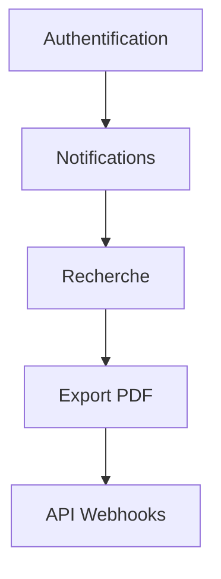
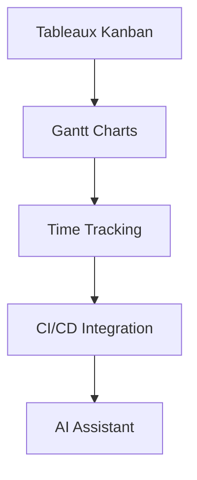
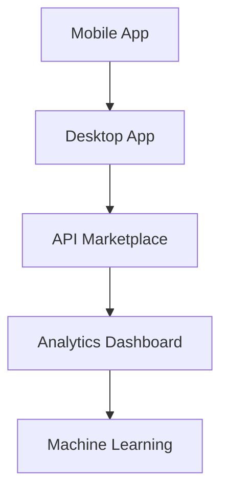

# Analyse du Projet SoftDesk - API de Gestion de Projets Collaboratifs

## 📊 Présentation Générale

**SoftDesk** est une API RESTful sécurisée développée avec **FastAPI** et **PostgreSQL** pour la gestion collaborative de projets de développement logiciel. L'application suit une architecture modulaire avec séparation des préoccupations.

### 🏗️ Architecture Technique

```
app/
├── models/          # Modèles SQLAlchemy
├── schemas/         # Schémas Pydantic
├── repositories/    # Couche d'accès aux données
├── services/        # Logique métier
├── controllers/     # Routeurs FastAPI
├── auth/           # Authentification et permissions
├── database/       # Configuration base de données
├── middleware/     # Middlewares personnalisés
└── utils/          # Utilitaires
```

## 🔍 Analyse des Fonctionnalités Existantes

### 1. **Authentification JWT**
**État actuel :** Système d'authentification basique avec tokens JWT
**Endpoints :** `/api/auth/login`, `/api/auth/refresh`

**Propositions d'amélioration :**
- ✅ **MFA (Authentification Multi-Facteurs)** : Ajouter l'authentification à deux facteurs
- ✅ **OAuth2** : Intégration avec Google, GitHub, Microsoft
- ✅ **Gestion des sessions** : Suivi des connexions actives
- ✅ **Rafraîchissement automatique** des tokens avec rotation sécurisée
- ✅ **Revocation de tokens** en temps réel

### 2. **Gestion des Utilisateurs**
**État actuel :** CRUD utilisateur avec conformité RGPD
**Champs :** username, email, age, consentements RGPD

**Propositions d'amélioration :**
- ✅ **Profils utilisateurs avancés** : photo, biographie, compétences
- ✅ **Système de rôles** : Admin, Manager, Developer, Viewer
- ✅ **Préférences utilisateur** : thème, notifications, langue
- ✅ **Historique d'activité** : suivi des actions utilisateur
- ✅ **Import/Export** des données personnelles (RGPD)

### 3. **Gestion des Projets**
**État actuel :** CRUD projets avec relation auteur
**Champs :** name, description, type, author_id

**Propositions d'amélioration :**
- ✅ **Workflows personnalisés** : États de projet configurables
- ✅ **Modèles de projet** : Templates réutilisables
- ✅ **Métriques projet** : avancement, vélocité, burndown charts
- ✅ **Archivage automatique** des projets inactifs
- ✅ **Import depuis GitHub/GitLab** : synchronisation des repositories

### 4. **Système d'Issues (Problèmes)**
**État actuel :** Issues avec statuts, priorités et tags
**Champs :** title, description, status, priority, tag, project_id, author_id

**Propositions d'amélioration :**
- ✅ **Workflows avancés** : Transitions d'état configurables
- ✅ **Attribution automatique** : Round-robin ou compétences
- ✅ **Dépendances entre issues** : Bloqueurs, prérequis
- ✅ **Estimations** : Points story, heures, complexité
- ✅ **Sprints/Iterations** : Gestion agile avec planning

### 5. **Système de Commentaires**
**État actuel :** Commentaires simples sur les issues
**Fonctionnalités :** CRUD avec relation auteur et issue

**Propositions d'amélioration :**
- ✅ **Édition riche** : Markdown, mentions, code highlighting
- ✅ **Réactions** : 👍, ❤️, 🎉, etc.
- ✅ **Threads de discussion** : Conversations structurées
- ✅ **Notifications intelligentes** : @mentions, abonnements
- ✅ **Historique des modifications** : versioning des commentaires

### 6. **Gestion des Contributeurs**
**État actuel :** Ajout/suppression de contributeurs aux projets
**Fonctionnalités :** Gestion basique des permissions

**Propositions d'amélioration :**
- ✅ **Permissions granulaires** : Lecture/Écriture/Admin par module
- ✅ **Invitations par email** : Workflow d'invitation complet
- ✅ **Groupes d'utilisateurs** : Teams avec permissions partagées
- ✅ **Audit des permissions** : Historique des changements
- ✅ **Permissions conditionnelles** : Basées sur le contexte

## 🚀 Propositions d'Évolution Stratégique

### Niveau 1 : Améliorations Immédiates


### Niveau 2 : Fonctionnalités Avancées


### Niveau 3 : Écosystème Étendu


## 🔧 Recommandations Techniques

### Sécurité
- **Rate Limiting** avancé par utilisateur/endpoint
- **Audit Logs** complets avec recherche
- **Chiffrement** des données sensibles au repos
- **Scan de vulnérabilités** automatisé

### Performance
- **Cache Redis** pour les requêtes fréquentes
- **Indexation avancée** PostgreSQL
- **Pagination optimisée** avec cursors
- **Compression** des réponses API

### Développement
- **Tests automatisés** avec couverture >90%
- **CI/CD** avec déploiement automatique
- **Documentation API** interactive et exhaustive
- **Monitoring** et alertes en temps réel

## 📈 Métriques de Succès

### Techniques
- Temps de réponse API < 100ms
- Disponibilité > 99.9%
- Charge utilisateur simultanée > 1000

### Métier
- Taux d'adoption > 80%
- Satisfaction utilisateur > 4.5/5
- Réduction du temps de gestion des projets > 30%

## 🎯 Feuille de Route Recommandée

### Phase 1 (1-2 mois)
- [ ] Implémenter MFA et OAuth2
- [ ] Ajouter système de notifications
- [ ] Améliorer l'interface de recherche
- [ ] Déployer monitoring de base

### Phase 2 (3-4 mois)
- [ ] Tableaux Kanban et workflows
- [ ] Intégration Git/GitHub
- [ ] Export avancé et rapports
- [ ] Application mobile React Native

### Phase 3 (5-6 mois)
- [ ] Intelligence artificielle (suggestions)
- [ ] Analytics avancés
- [ ] Marketplace d'extensions
- [ ] Intégration écosystème DevOps

## 💡 Points d'Attention

### Architecture
- **Maintenabilité** : Le code est bien structuré mais pourrait bénéficier de plus de tests unitaires
- **Évolutivité** : L'architecture supporte bien l'évolution mais nécessite un plan de scaling
- **Sécurité** : Bonne base mais peut être renforcée avec des audits réguliers

### Expérience Utilisateur
- **API Design** : RESTful bien conçue mais manque de versioning
- **Documentation** : Swagger/Redoc présents mais peut être enrichie
- **Ergonomie** : Interface basique, opportunité d'amélioration

## 🔮 Vision à Long Terme

SoftDesk a le potentiel de devenir une plateforme complète de gestion de projets techniques, intégrant les meilleures pratiques du développement agile avec une approche centrée sur la collaboration et la productivité.

**Objectif stratégique** : Positionner SoftDesk comme la solution de référence pour les équipes de développement cherchant une alternative open-source aux solutions propriétaires.